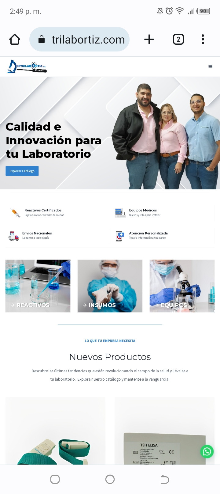

# Caso de Estudio: E-commerce Corporativo Distrilab Ortiz

**Rol:** Desarrolladora Web End-to-End  
**Stack:** WordPress, WooCommerce, Hosting/VPS, WhatsApp API Integración  
**Estado:** Proyecto completado (Sitio actualmente offline por cese de dominio del cliente)

## 📌 Contexto del Proyecto
Distrilab Ortiz requería una presencia digital sólida para su catálogo de equipos médicos e insumos de laboratorio. El objetivo principal era crear una tienda corporativa funcional que, en lugar de un carrito de compras tradicional, permitiera a los clientes solicitar cotizaciones directas y personalizadas.

## 💡 Mi Solución
Fui responsable del desarrollo de principio a fin:
* **Infraestructura:** Gestión del dominio, configuración del servidor VPS y correos corporativos.
* **Desarrollo Frontend/CMS:** Implementación y personalización de WordPress + WooCommerce.
* **Diseño UI/UX:** Interfaz limpia, enfocada en la confianza corporativa y 100% responsiva (Mobile-First).
* **Conversión:** Integración de un sistema de cotizaciones conectado directamente a la API de WhatsApp para agilizar las ventas.
* **Seguridad y Capacitación:** Configuración de roles de usuario y entrega de material en video para capacitar al equipo del cliente.

## 📱 Vista Previa del Diseño (Mobile)

---
*Desarrollado por Patricia Mago - [Mi LinkedIn](https://www.linkedin.com/in/patriciamago/)*
